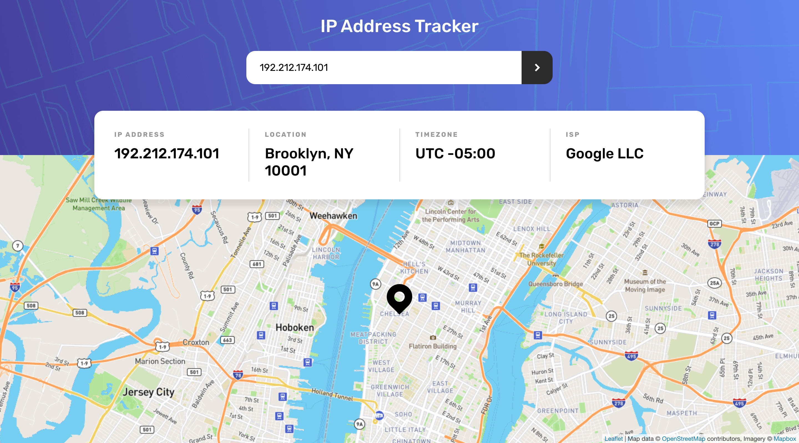
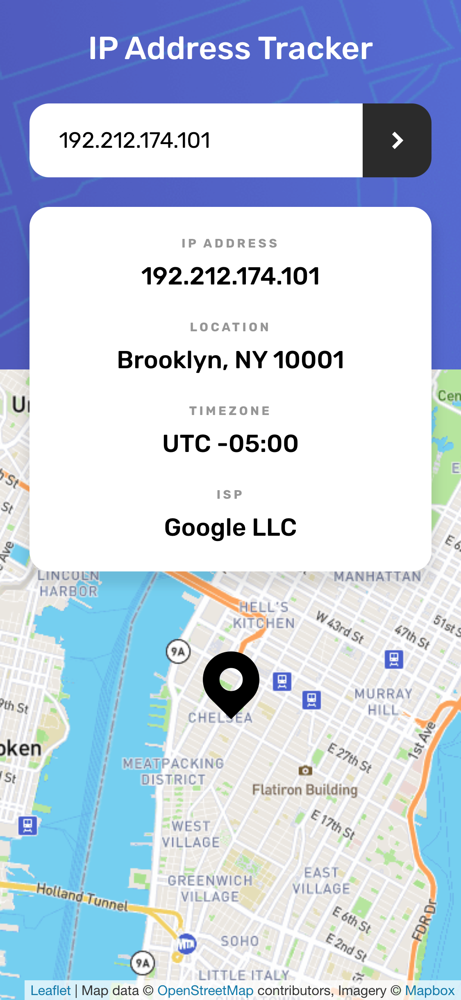

# Frontend Mentor - IP address tracker solution

This is a solution to the [IP address tracker challenge on Frontend Mentor](https://www.frontendmentor.io/challenges/ip-address-tracker-I8-0yYAH0). Frontend Mentor challenges help you improve your coding skills by building realistic projects.

## Table of contents

- [Overview](#overview)
  - [The challenge](#the-challenge)
  - [Screenshot](#screenshot)
  - [Links](#links)
- [My process](#my-process)
  - [Built with](#built-with)
- [Author](#author)

## Overview

### The challenge

Users should be able to:

- View the optimal layout for each page depending on their device's screen size
- See hover states for all interactive elements on the page
- Search for any IP addresses or domains and see the key information and location

### Screenshot

Screenshot from desktop version

Screenshot from mobile version

### Links

- Solution URL: [FrontendMentor Solution URL](https://www.frontendmentor.io/solutions/ip-address-track-using-react-and-expressjs-ws59rGcw-)
- Live Site URL: [Heroku URL](https://ip-address-tracker-bakkaya.herokuapp.com/)

## My process

### Built with

### Built with

- Flexbox
- CSS Grid
- Mobile-first workflow
- [React](https://reactjs.org/) - JS library
- [Express](https://expressjs.com) - Backend

## Author

- Website - [Basar Akkaya](http://basarakkaya.com)
- Frontend Mentor - [@basarakkaya](https://www.frontendmentor.io/profile/basarakkaya)
